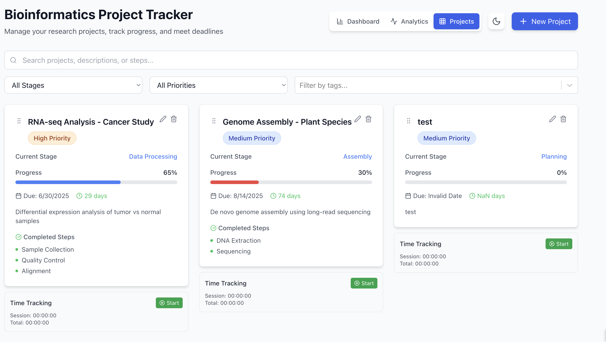
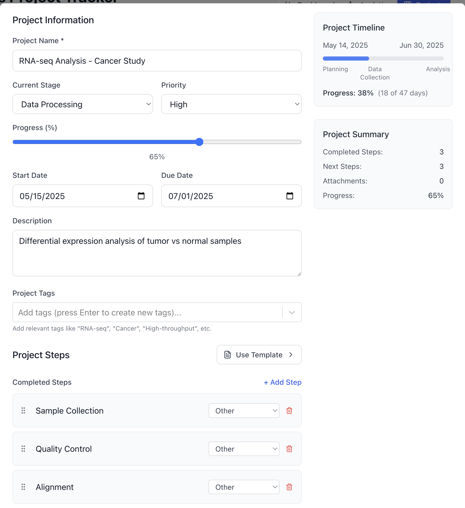

# Bioinformatics Project Tracker


A comprehensive web application designed specifically for bioinformatics researchers to manage, track, and organize their research projects efficiently. Built with React and modern web technologies, this tool provides an intuitive interface for project management with features tailored to computational biology workflows.

## Features

### Project Management
- **Drag-and-drop project organization** with sortable cards
- **Multi-stage workflow tracking** (Planning → Data Collection → Analysis → Complete)
- **Priority management** (Low, Medium, High, Critical)
- **Progress tracking** with visual progress bars and percentage completion
- **Timeline visualization** with project deadlines and milestones

### Bioinformatics-Specific Templates
- **Pre-built workflow templates** for common analyses:
  - RNA-seq Analysis
  - Genome Assembly
  - Variant Calling
  - Metagenomics
- **Step categorization** (Lab Work, Analysis, Documentation, Review)
- **Smart suggestions** for common bioinformatics steps

### Time Tracking
- **Built-in time tracker** for each project
- **Session-based tracking** with start/stop functionality
- **Cumulative time reporting** across projects
- **Productivity insights** and time analytics

### Advanced Analytics
- **Dashboard overview** with key metrics
- **Progress visualization** using charts and graphs
- **Smart insights** and project recommendations
- **Deadline monitoring** with overdue alerts
- **Performance metrics** and completion rates

### User Experience
- **Dark/Light mode** toggle for comfortable viewing
- **Responsive design** that works on desktop, tablet, and mobile
- **Advanced search and filtering** by stage, priority, tags, and text
- **File attachment support** for protocols, data files, and documents
- **Tagging system** for project categorization

### Data Export
- **PDF reports** with project summaries and progress
- **Word document export** for detailed project documentation
- **Local data persistence** with browser storage

## Screenshots

### Main Dashboard

*Main dashboard showing project cards with drag-and-drop functionality, filtering options, and progress visualization*

### Project Details & Analytics

*Detailed project view with step tracking, time management, and analytics dashboard*

## Quick Start

### Prerequisites
- Node.js 14.0 or higher
- npm or yarn package manager

### Installation

1. **Clone the repository**
   ```bash
   git clone https://github.com/yourusername/bioinf-tracker.git
   cd bioinf-tracker
   ```

2. **Install dependencies**
   ```bash
   npm install
   ```

3. **Start the development server**
   ```bash
   npm start
   ```

4. **Open your browser**
   Navigate to `http://localhost:3000` to view the application.

### Building for Production

```bash
npm run build
```

This creates an optimized production build in the `build` folder.

## Usage Guide

### Creating Your First Project

1. **Click "New Project"** in the top right corner
2. **Fill in basic information**:
   - Project name (e.g., "RNA-seq Analysis - Cancer Study")
   - Current stage (Planning, Data Collection, etc.)
   - Priority level
   - Start and due dates
   - Description

3. **Add project steps**:
   - Use templates for common workflows
   - Drag and drop to reorder steps
   - Categorize steps by type (Lab Work, Analysis, etc.)

4. **Organize with tags**: Add relevant tags like "RNA-seq", "Cancer", "High-throughput"

### Managing Projects

- **Drag cards** to reorder projects by priority
- **Use the search bar** to find specific projects
- **Filter by stage, priority, or tags** using the filter controls
- **Track time** using the built-in timer for each project
- **Attach files** like protocols, data files, or documentation

### Analytics and Reporting

- Switch to **Dashboard view** for overview metrics
- Use **Analytics view** for detailed insights and recommendations
- **Export reports** in PDF or Word format for sharing or archiving

## Technical Architecture

### Built With
- **React 18+** - Modern JavaScript framework
- **Tailwind CSS** - Utility-first CSS framework
- **Recharts** - Responsive chart library
- **DND Kit** - Modern drag and drop library
- **Date-fns** - Modern date utility library
- **jsPDF & docx** - Document generation
- **React Select** - Enhanced select components

### Key Dependencies
```json
{
  "@dnd-kit/core": "^6.3.1",
  "@dnd-kit/sortable": "^10.0.0",
  "date-fns": "^4.1.0",
  "docx": "^9.5.0",
  "jspdf": "^3.0.1",
  "lucide-react": "^0.511.0",
  "react": "^19.1.0",
  "react-select": "^5.10.1",
  "recharts": "^2.15.3"
}
```

### Project Structure
```
bioinf-tracker/
├── public/                 # Static assets
├── src/
│   ├── App.js             # Main application component
│   ├── index.js           # Application entry point
│   ├── index.css          # Global styles with Tailwind
│   └── ...
├── package.json           # Dependencies and scripts
├── tailwind.config.js     # Tailwind configuration
└── README.md             # This file
```

## Configuration

### Environment Variables
Create a `.env` file in the root directory for custom configuration:

```env
REACT_APP_VERSION=1.0.0
REACT_APP_BUILD_DATE=06/02/2025
```

### Customization

#### Adding New Templates
Edit the `BIOINFORMATICS_TEMPLATES` object in `App.js` to add new workflow templates:

```javascript
const BIOINFORMATICS_TEMPLATES = {
  'Your New Template': {
    category: 'Analysis',
    steps: [
      { text: 'Step 1', category: 'Lab Work' },
      { text: 'Step 2', category: 'Analysis' },
      // ... more steps
    ]
  }
};
```

#### Modifying Stages or Priorities
Update the arrays in `App.js`:

```javascript
const stages = ['Planning', 'Data Collection', /* your stages */];
const priorities = ['Low', 'Medium', 'High', 'Critical'];
```

## Contributing

We welcome contributions! Please follow these steps:

1. **Fork the repository**
2. **Create a feature branch**: `git checkout -b feature/amazing-feature`
3. **Commit your changes**: `git commit -m 'Add amazing feature'`
4. **Push to the branch**: `git push origin feature/amazing-feature`
5. **Open a Pull Request**

### Development Guidelines
- Follow React best practices
- Use Tailwind CSS for styling
- Ensure responsive design
- Add JSDoc comments for complex functions
- Test on multiple browsers

## License

This project is licensed under the MIT License - see the [LICENSE](LICENSE) file for details.

## Author

**Eren Ada, PhD**
- GitHub: [@erenada](https://github.com/erenada)
- Email: erenada@gmail.com

## Acknowledgments

- React community for excellent documentation
- Tailwind CSS for the utility-first approach
- Recharts for beautiful data visualization
- All contributors to the open-source libraries used

## Support

If you encounter any issues or have questions:

1. Check the [Issues](https://github.com/yourusername/bioinf-tracker/issues) section
2. Create a new issue with detailed description
3. For urgent matters, contact the author directly

## Roadmap

### Version 2.0 (Planned)
- [ ] Team collaboration features
- [ ] Cloud synchronization
- [ ] Advanced analytics with machine learning insights
- [ ] Integration with common bioinformatics tools
- [ ] Mobile app development
- [ ] API for third-party integrations

### Version 1.1 (Near-term)
- [ ] Enhanced template library
- [ ] Bulk project operations
- [ ] Calendar integration
- [ ] Notification system
- [ ] Data backup/restore functionality

---

**Created:** June 2, 2025  
**Last Updated:** June 2, 2025  
**Version:** 1.0.0

Made for the bioinformatics community
